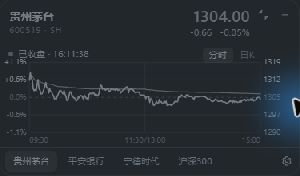
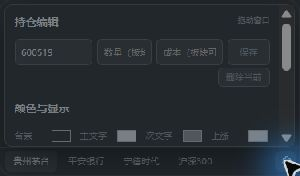

# 蓝牙助手（Bluetooth Assistant）

一款面向 Windows 的轻量股票行情浮窗。支持 A 股实时价格、分时图、日 K、持仓盈亏和行业板块观察，界面紧凑、透明度与颜色可调，窗口失去焦点后会自动收回。

> 当前版本：**v0.1**

## 软件界面

### 分时行情



### 持仓与显示设置



## 功能特点

- **微型行情条**：默认尺寸约 `232 × 28`，显示名称、走势、现价和涨跌幅。
- **分时与日 K**：分时图采用昨收居中、上下对称涨跌幅坐标；日 K 使用前复权数据。
- **持仓盈亏**：输入股票代码、持仓数量和成本价，显示今日盈亏、总盈亏和收益率。
- **板块观察**：支持输入 `881129` 查看“通信设备”板块分时和日 K，板块无需填写数量与成本。
- **托盘信息**：鼠标悬停托盘图标可查看当前标的价格和盈亏信息。
- **自动收回**：展开窗口失去焦点或按下 `Esc` 后恢复为微型模式。
- **位置记忆**：记住微型窗口上次位置，并适配多显示器与工作区边缘。
- **个性化显示**：背景、文字、涨跌、分时线、均价线和透明度均可设置。
- **真实行情**：通过东方财富公开接口获取数据，约 3 秒刷新；接口异常时提示数据不可用，不生成模拟价格。

## 安装

1. 在 GitHub 项目的 **Releases** 页面下载 `SlackTrader-v0.1-Setup-x64.exe`。
2. 双击安装包完成安装。
3. 升级时直接覆盖安装，应用会沿用原用户数据。

覆盖安装会保留股票列表、持仓数量、成本价、颜色、透明度、窗口位置和图表模式。升级时请保持应用标识 `com.bluetoothassistant.desktop` 不变。

## 使用方法

### 添加或修改股票

1. 展开窗口并进入设置。
2. 输入 6 位股票代码、持仓数量和成本价。
3. 点击“保存”。再次保存相同代码即可修改数量和成本。

### 添加板块

输入板块代码 `881129`，数量与成本留空，然后点击“保存”，即可查看通信设备板块行情。

### 操作方式

| 操作 | 功能 |
| --- | --- |
| 微型窗口滚轮 | 切换观察标的 |
| 双击微型窗口 | 展开窗口 |
| 右键微型窗口 | 展开并打开设置 |
| 中键微型窗口 | 隐藏窗口 |
| `Esc` | 收回窗口 |
| `Alt + Shift + S` | 全局显示或隐藏 |
| 托盘图标左键 | 显示或隐藏 |

## 用户数据

Windows 用户数据默认存放在：

```text
%LOCALAPPDATA%\com.bluetoothassistant.desktop\EBWebView\Default\Local Storage
```

覆盖安装不会替换该目录。需要迁移电脑时，可在应用退出后备份上述目录。

## 开发环境

- Windows 10/11 x64
- Node.js 20+
- Rust stable
- Microsoft Edge WebView2 Runtime

GitHub Release 同时提供：

- `SlackTrader-v0.1-Setup-x64.exe`：Windows 可安装版本。
- `SlackTrader-v0.1-Portable-x64.exe`：免安装便携版本。
- `SlackTrader-v0.1-Source.zip`：对应版本源码。

```powershell
npm install
npm run tauri dev
```

### 构建免安装版本

```powershell
npm run build:portable
```

输出：

```text
src-tauri/target/release/bluetooth-assistant.exe
```

### 构建安装包

```powershell
npm run tauri build
```

输出：

```text
src-tauri/target/release/bundle/nsis/蓝牙助手_<版本>_x64-setup.exe
```

## 项目结构

```text
src/                         前端界面与行情图表
src/market/                  行情数据适配层
src-tauri/src/               Tauri/Rust 桌面端逻辑
src-tauri/tauri.conf.json    窗口、应用标识与打包配置
```

## 数据说明

- 个股、指数及映射板块数据来自东方财富公开行情接口。
- `881129` 是同花顺通信设备行业代码，当前映射到东方财富同名板块 `90.BK0448`；不同平台的成分股范围和计算方法可能存在差异。
- 免费公开行情可能出现延迟、中断或字段调整，本项目展示最后成功获取的数据与时间。

## 常见问题

### 覆盖安装后数据是否保留？

保留。安装包继续使用相同应用标识和用户数据目录。不要先卸载并主动删除应用数据目录。

### 为什么窗口点击外部后变小？

这是默认交互逻辑，用于保持桌面整洁。再次双击微型窗口即可展开。

### 为什么行情暂时不更新？

确认网络连接和 A 股交易时间。休市期间显示最后成交数据；接口异常时状态栏会显示行情不可用。

## 说明

本项目用于行情观察和持仓记录，显示结果不构成投资建议。交易前请以交易所及券商数据为准。
